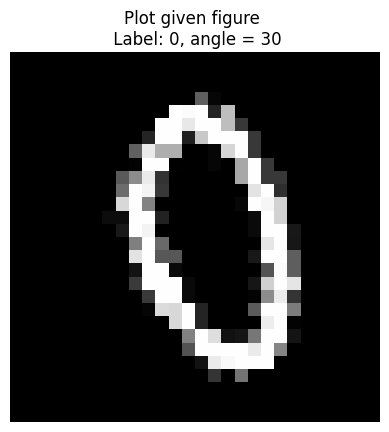

# Assignment 1 on Digit Classification

It is recommened to create a virtual environment using venv before proceeding. \
To install the required packages, use the following command `pip install -r requirements.txt`

## ✅ Running the code ✅
Ensure you are in the same directory as this file and run
```
python main.py --oversample_rate (default: 8)
```

To run the pytest tests, run 
```
pytest pytests/
```
This will run all the unittest (pytest) files within the `pytest` directory.

> **Please check the `logs` directory for script running logs and model training logs. Especially the `WARNING` level logs**

## 📊 Reports 📊
- The best model, trained on all orientations, achieves more than 99% accuracy on the holdout set. 
- The confusion matrix shows how numbers such as $2$ and $7$ can have a slight chance of being misclassified as each other. *This is fairly expected due to their similar orientation and shape*

### Task 1 and Task 2
- Corresponding files stored in `grading_tasks/task1_rotate_img.py` and `grading_tasks/task2_oversample.py`
- All the datapoints are rotated as required and the corresponding angles information is also stored as a tuple with the data points and labels

Rotated sample preview <br>



### Task 3 and Task 4
- Corresponding files stored in `grading_tasks/task3_train.py` and `grading_tasks/task4_monitoring.py`. Check the `WARNING` logs for easier checking.

> We play with the number of linear layers and number of convolutional layers as hyperparameters

- We start by Training on set of **0** degrees rotation &rarr; Check performance on ground truth of **0** degrees &rarr; Monitoring Script happy &rarr;  Check performance on ground truth of **10** degrees &rarr; Monitoring Script unhappy 
- Add **10** degrees rotation data for training &rarr;  Check performance on ground truth of **0 and 10** degrees &rarr; Monitoring Script happy &rarr;  Check performance on ground truth of **-30** degrees &rarr; Monitoring Script unhappy 
- Add **-30** degrees rotation data for training &rarr;  Check performance on ground truth of **0, 10, -30** degrees &rarr; Monitoring Script happy &rarr;  Check performance on ground truth of **20** degrees &rarr; Monitoring Script unhappy 
- Finally add **all**  data for training &rarr;  Check performance on ground truth of **all** degrees &rarr; Monitoring Script happy 
-

## ➕ Additional information ➕
- Plots and figures will be stored in the `plots` directory
- Performance metrics will be stored in the `performance_metrics` directory
- All grading functions are stored in the `grading_tasks` directory
- The code has been run and trained on *my 8GB CPU machine*


## 😁 Code-cleanliness! 😁
- Type hints from the `typing` module are leveraged
- All code is pep-8 style formatted using `ruff`, `isort` and `black` as pre-commit hooks


## References
- Pytorch Documentation