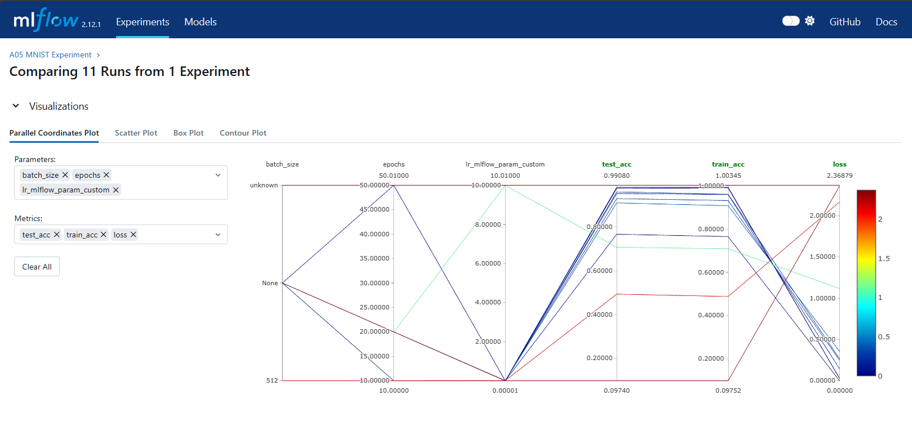

# MLFlow Assignment

**Note**: It is recommended to use a virtual environment to run the same. Requirements can be found in the `requirements.txt` file.  
**Tip**: Refer to the [following blog](https://anbasile.github.io/posts/2017-06-25-jupyter-venv/) to learn more about using virtual environments and corresponding kernels in VSCode

### Showing sub-experiments

### Comparing subgroup of models

### Comparing across experiments
Choosing the models (observe the ticked boxes)

Comparing all measures
