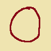
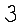
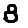

# Assignment on using FastAPI

> Note: It is recommened to use a virtual environment for the experiments. All dependencies have been listed in the `requirements.txt` file

One may run the app using the command 
```
python app.py --model_path mnist-epoch-10.keras
```

**API being tested at** http://localhost:8000/docs#/default/predict_predict_post. This is via the **Swagger UI**

I have done Task 1 and Task 2 together, and have added necessary comments as required about which task is being performed in a given code section

**TODO: ADD UNIT TESTS**

## Performance of API model on custom inputs
All the images were generated using MS Paint. I tried to keep the inputs varying in size and colour to test the model's real-world performance.

| Sr No.    |  Digit (Image) | Image Size (px * px)  | Actual Class | Predicted Class |
|---------|--------------|:-----------------:|:--------------------:|:----------------------:|
| 1       |    | 100 * 100 | 0  | 3    |
| 2       |    | 28 * 28 | 1  | 3    |
| 3       |    | 285 * 153 | 2  | 3    |
| 4       |    | 28 * 28 | 3  | 5    |
| 5       |    | 28 * 28 | 4  | 4    |
| 6       |    | 285 * 153 | 5  | 3    |
| 7       |    | 128 * 202 | 6  | 9    |
| 8       |    | 100 * 100 | 7  | 7    |
| 9       |    | 28 * 28 | 8  | 3    |
| 10       |    | 28 * 28 | 9  | 9    |

We see that the model does not perform well. This can be attributed to Image Transforms not being applied while training. Additionally, the model struggles with different input shapes.
