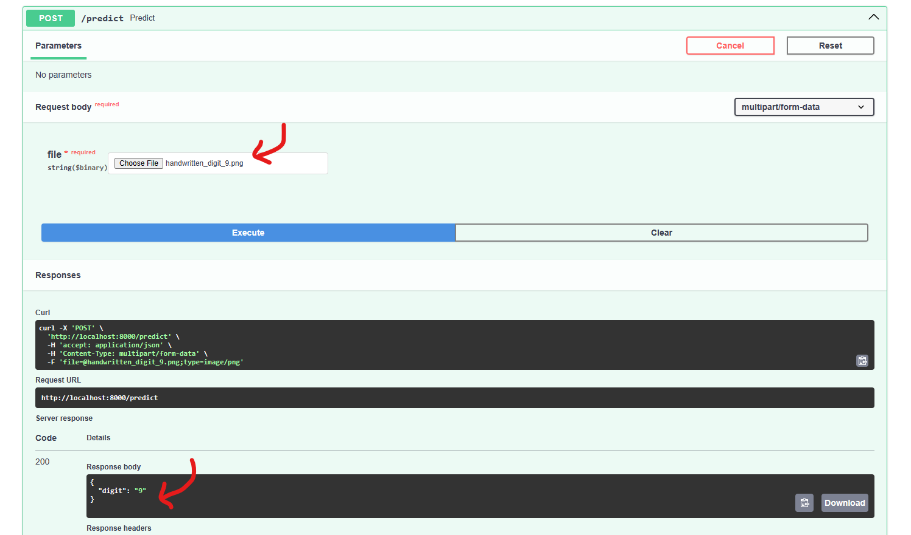

# Assignment on Docker, Prometheus and Grafana

*Note*: It is highly recommended to use a virtual environment for running the code. Requirements are given in the `./app/requirements.txt` file

## ✅Easy Direct Usage✅

Simply run the following command

``` bash
docker-compose up
```

The three containers and their respective ports are given at:
* FastAPI: http://localhost:8000/
* Prometheus: http://localhost:9090/
* Grafana: http://localhost:3000/

> The main code is the `main.py` file
> Since the keras model is kept in the `./app` directory, the path to the keras model in the Swagger UI should be written as: `./mnist-model.keras`


# ✨Task-wise pointers✨

## ✨TASK 1✨

**Repo Structure**
```bash
project/
├── app/
│   └── main.py
├── config/
│   ├── prometheus.yml
│   └── grafana/
│       ├── provisioning/
│       │   ├── dashboards/
│       │   │   └── dashboard.yml
│       │   └── datasources/
│       │       └── datasource.yml
│       └── grafana.ini
└── requirements.txt
```
### 🧧Setting up Prometheus and Grafana🧧
- I downlaoded the offical Prometheus and Grafana softwares from their respective websites and placed them in the root project directory (haven't included it in GitHub )
- Ran the main field simply by `python -m app.main`

**Starting Prometheus**:
> - Download Prometheus from `https://prometheus.io/download/`, extract it 
> - Copy the `config/prometheus.yml` file from my project to the Prometheus directory
> - Run the following command : `./prometheus --config.file=prometheus.yml`

**Starting Grafana** :
> - Download Prometheus from `https://grafana.com/grafana/download`, extract it 
> - Copy the `config/grafana` directory from my project to the Prometheus directory
> - Run the following command : `./bin/grafana-server --homepath=./config/grafana`


### 🔧Adding Gauges🔧
- All the required gauges and counters are added to the `main.py` file with corresponding logic

### 📱Testing via other devices📱
- Opened the command prompt from Windows and ran `ipconfig`. Under the Wireless LAN adapter Wi-Fi, I got my IPv4 Address as `192.168.10.105`
- From another device connected to the same network, I typed the url : `http://192.168.10.105:8000.`
- Could acccess and test my API with this endpoint


## ✨TASK 2✨

### ⚓Setting up Docker⚓
- Wrote the DockerFile, docker-compose file, other yml files properly and setup the containers using
```bash
$ docker compose up --build # for the first time
# OR
$ docker compose # for subsequent runs, building is not necessary so this works fine
```
- Port mapping is taken care of by the docker-compose file, and the respective yml files for grafana and prometheus. As mentined above, the three containers and their respective ports are given at:
    * FastAPI: http://localhost:8000/
    * Prometheus: http://localhost:9090/
    * Grafana: http://localhost:3000/
- Setting up CPU utilsation is done by adding the `cpus` option in the compose file. We set it to 1. The image below shows how only 1 cpu is utlised


### 💯Spinning up more instances of the container💯
The following changes are made (also stated in the compose file and the prometheus yaml file)
- Instead of only one app service in, we manually create multiple ones 
```bash
  ##############################
  # APP SERVICE FOR ONE INSTANCE
  ##############################
   app:
     build:
       context: ./app
     restart: unless-stopped
     ports:
       - 8000:8000
     cpus: 1
     networks:
       example-network:
         ipv4_address: 172.16.238.10

  ##############################
  # APP SERVICE FOR MULTIPLE INSTANCES
  ##############################
  app:
    build:
      context: ./app
    restart: unless-stopped
    ports:
      - 8000:8000
    cpus: 1
    networks:
      example-network:
        ipv4_address: 172.16.238.10

  app2:
    build:
      context: ./app
    restart: unless-stopped
    ports:
      - 8001:8000
    cpus: 1
    networks:
      example-network:
        ipv4_address: 172.16.238.20

  app3: ...
```

- Similarly add this to the prometheus yaml file
```bash
  # Replace one instance of the *app* (as given below)
  - job_name: 'app'
    scrape_interval: 5s
    static_configs:
      - targets: ['app:8000']
 
 # with multiple instances
  - job_name: 'app'
    scrape_interval: 5s
    static_configs:
      - targets: ['app:8000']  # As earlier

  - job_name: 'app2'
    scrape_interval: 5s
    static_configs:
      - targets: ['app2:8000']  # New configuration for app2 instance

  - job_name: 'app3' ...
```


# 📸Snapshots📸

## ⏩FastAPI⏩



## 🐎Prometheus🐎
> Note: These are the custom metrics and gauges as required `api_requests_total`, `api_runtime_seconds`,`processing_time_per_char_microseconds_SODA`
> Added SODA for fun xD


## 🌞Grafana🌞


**Default Dashboard**


### 🔴Checking Boundary Conditions🔴
- We check the boundary conditions for the model's presence in the `load_model` function in the `main.py` file

### 😁 Code-cleanliness! 😁
- Type hints from the typing module are leveraged
- All code is pep-8 style formatted using ruff, isort and black as pre-commit hooks

### References
- Documentation for Prometheus, Grafana and FastAPI