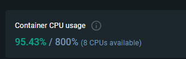

https://github.com/docker/compose/issues/11168#issuecomment-1800362132

install pyyml first then docker-compose

./app/mnist-model.keras

./mnist-model.keras # with this v2

<!-- when only the app without docker -->
./mnist-model.keras

<!-- 1 CPUs -->

