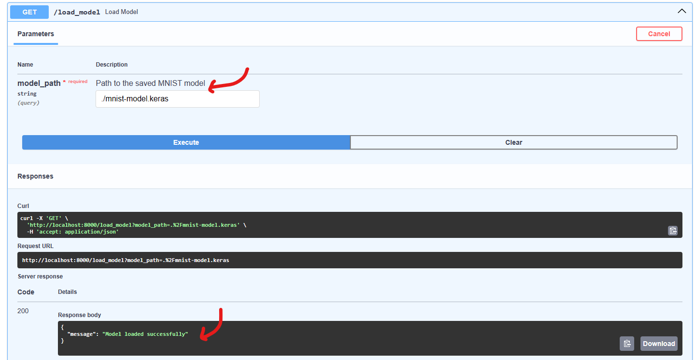
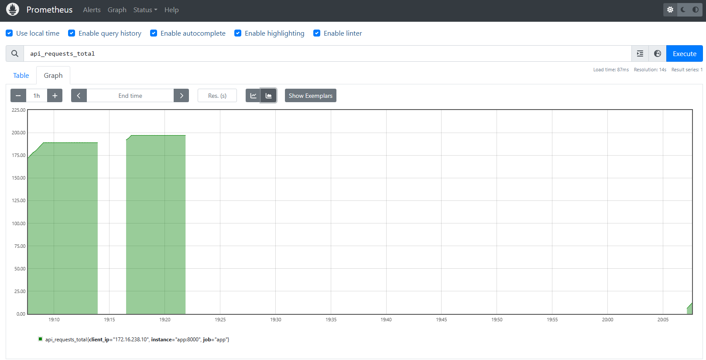
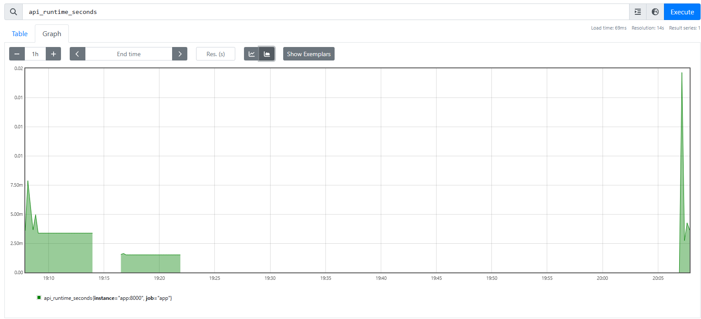
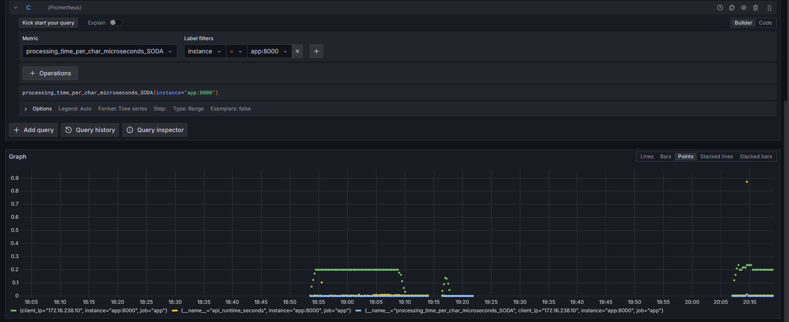

# Assignment on Docker, Prometheus and Grafana

*Note*: It is highly recommended to use a virtual environment for running the code. Requirements are given in the `./app/requirements.txt` file

## Easy Direct Usage

Simply run the following command

``` bash
docker-compose up
```

The three containers and their respective ports are given at:
* FastAPI: http://localhost:8000/
* Prometheus: http://localhost:9090/
* Grafana: http://localhost:3000/

> The main code is the `main.py` file
> Since the keras model is kept in the `./app` directory, the path to the keras model in the Swagger UI should be written as: `./mnist-model.keras`


# Task-wise pointers:

## TASK 1

Repo Structure
```bash
project/
├── app/
│   └── main.py
├── config/
│   ├── prometheus.yml
│   └── grafana/
│       ├── provisioning/
│       │   ├── dashboards/
│       │   │   └── dashboard.yml
│       │   └── datasources/
│       │       └── datasource.yml
│       └── grafana.ini
└── requirements.txt
```
### Setting up Prometheus and Grafana
- I downlaoded the offical Prometheus and Grafana softwares from their respective websites and placed them in the root project directory (haven't included it in GitHub )
- Ran the main field simply by `python -m app.main`

**Starting Prometheus**:
> - Download Prometheus from `https://prometheus.io/download/`, extract it 
> - Copy the `config/prometheus.yml` file from my project to the Prometheus directory
> - Run the following command : `./prometheus --config.file=prometheus.yml`

**Starting Grafana** :
> - Download Prometheus from `https://grafana.com/grafana/download`, extract it 
> - Copy the `config/grafana` directory from my project to the Prometheus directory
> - Run the following command : `./bin/grafana-server --homepath=./config/grafana`


### Adding Gauges
- All the required gauges and counters are added to the `main.py` file with corresponding logic

### Testing via other devices
- Opened the command prompt from Windows and ran `ipconfig`. Under the Wireless LAN adapter Wi-Fi, I got my IPv4 Address as `192.168.10.105`
- From another device connected to the same network, I typed the url : `http://192.168.10.105:8000.`
- Could acccess and test my API with this endpoint


## TASK 2

### Setting up Docker
- Wrote the DockerFile, docker-compose file, other yml files properly and setup the containers using
```bash
$ docker compose up --build # for the first time
# OR
$ docker compose # for subsequent runs, building is not necessary so this works fine
```
- Port mapping is taken care of by the docker-compose file, and the respective yml files for grafana and prometheus. As mentined above, the three containers and their respective ports are given at:
    * FastAPI: http://localhost:8000/
    * Prometheus: http://localhost:9090/
    * Grafana: http://localhost:3000/
- Setting up CPU utilsation is done by adding the `cpus` option in the compose file. We set it to 1. The image below shows how only 1 cpu is utlised


- Spinning up more instances of the container:
    - So far, āll tries have resulted in port mapping issues
    - Tried using the `docker compose scale` command; assigned different ports the app run like `ports: - 8000-8003:80` in the compose file; duplicated the apps container part of the compose file and manually assigned different ports, but still could not connect it to the Prometheus and subsequently Grafana endpoints :( 


# Snapshots

## FastAPI



## Prometheus
> Note: These are the custom metrics and gauges as required `api_requests_total`, `api_runtime_seconds`,`processing_time_per_char_microseconds_SODA`
> Added SODA for fun xD





## Grafana




**Default Dashboard**

